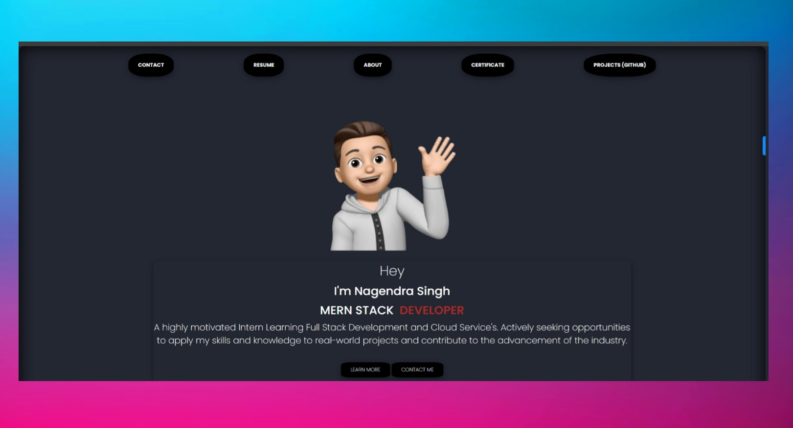

# Portfolio

---

## Introduction

This is My Portfolio that describes about my Skills

.mp4)

---

## Try Out

You can also clone & create this repo locally with the following command:

[Clone Repo](https://github.com/thewebtech17/Portfloio-New-)

---

## Tech Stack + Features

### Platform –

- [Vite.Js](https://vitejs.dev/) – Easily preview & deploy changes with git

### UI –

- [HTML5](https://en.wikipedia.org/wiki/HTML5) – For structuring and presenting hypertext
- [CSS3](https://en.wikipedia.org/wiki/CSS) – Used for structuring, styling, and formatting web pages.
- [Tailwind CSS](https://tailwindcss.com/) – Utility-first CSS framework for rapid UI development
- Poppins/font – Optimize custom fonts and remove external network requests for improved performance

### Tools

- [HTML5](https://www.w3.org/html/)
  
- [CSS3](https://www.w3schools.com/css/)
  
- [JavaScript](https://developer.mozilla.org/en-US/docs/Web/JavaScript)
  
- [Tailwind CSS](https://tailwindcss.com/)
  

### Hooks & Utilities –

- [UseLocalStorage](https://en.wikipedia.org/wiki/HTML5) – Persist data in the browser's local storage

### Code Quality –

- [Prettier](https://prettier.io/) – Opinionated code formatter for consistent code style

---

## Author

[@thewebtech17](https://github.com/thewebtech17) – Nagendra Singh Shekhawat

---

## Thank You

Hope it is useful. Please do ⭐ the repo. Happy coding!
